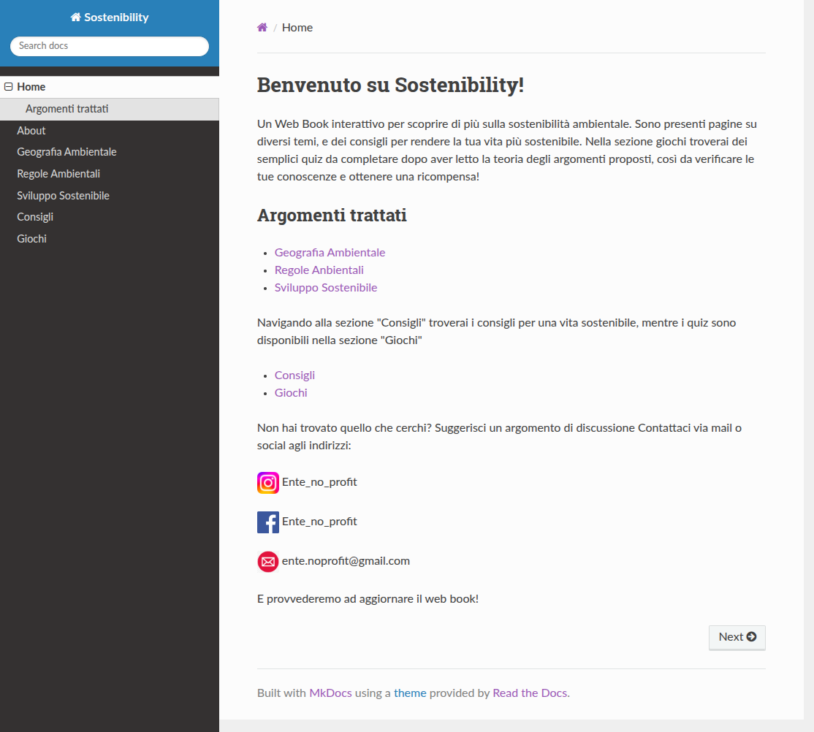

# Sostenibility host

Pagina github utilizzata per hostare il sito del progetto [Sostenibility](https://github.com/IncredibleLego/Sostenibility)

Il sito si trova all'indirizzo https://incrediblelego.github.io/SostenibilityHost/

Allo stesso indirizzo è possibile visualizzare il tema d'esame del progetto

